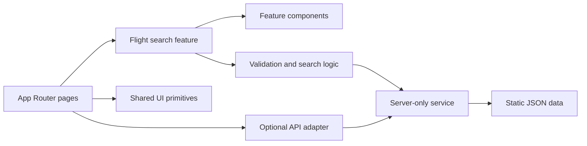

# Transavia Flight Finder

A flight-search assignment built with Next.js and TypeScript using the provided static data.

## Run locally

```bash
npm install
npm run dev
```

Open [http://localhost:3000](http://localhost:3000).

```bash
npm test
npm run test:e2e
npm run lint
npm run build
```

## Tech

Next.js · React · TypeScript · React Aria Components · Zod · CSS Modules · Vitest · Playwright · ESLint · Husky ·

## Structure / architecture



The URL stores the airport pair and date, so searches are bookmarkable and server-rendered. Zod validates data at system boundaries, while domain logic stays separate from UI and transport concerns.

## What I would improve for a larger project

- Replace static data with an external API and add caching, pagination, and rate limiting.
- Add monitoring, structured logs, and error reporting.
- Expand accessibility, visual-regression, integration, and booking-handoff coverage.
- Add CI/CD with preview environments and production performance checks.
